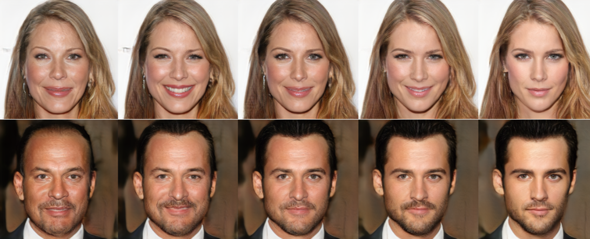
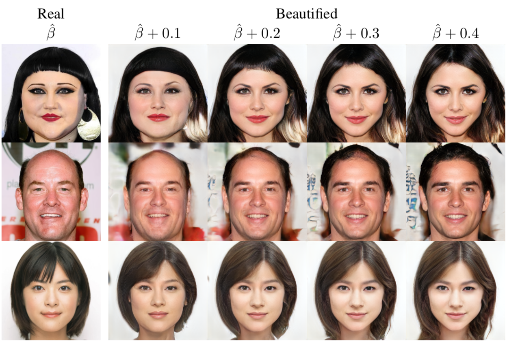

# Beholder-GAN: Generation and Beautification of Facial Images with Conditioning on Their Beauty Level  

This is the code repository for our paper: [https://arxiv.org/abs/1902.02593](https://arxiv.org/abs/1902.02593)  
  
### Faces Generation Conditioned On Beauty  
  
  
*Generated faces. left to right - least attractive to most attractive.*  
  
### Beautification Of Real Faces  
  
  
*Beautification of real faces. Left column are the input real faces. To the right are the beautified images with an increasing beauty level.*  
  
Our generating procedure is heavily based on the implementation of progressive growing of GANs. For more information, please refer to the original implementation:  
[https://github.com/tkarras/progressive_growing_of_gans](https://github.com/tkarras/progressive_growing_of_gans)  
  
  
## Installation  
  
We recommend using Anaconda for python and creating a virtual environment the same way we did.  
Anaconda can be downloaded from here: [https://www.anaconda.com/distribution/](https://www.anaconda.com/distribution/)  

Create environment for Python 3.6:  
```
conda create -n beholder python=3.6 anaconda
```
Enter the environment and install python requirements:  
```
conda activate beholder
pip install -r requirements-pip.txt
```
  
## Datasets  
  
The datasets we worked on can be found in these links:  
* CelebA-HQ: [CelebA](http://mmlab.ie.cuhk.edu.hk/projects/CelebA.html), [deltas](https://drive.google.com/drive/folders/0B4qLcYyJmiz0TXY1NG02bzZVRGs).  
* SCUT-FBP-5500: [dataset](https://github.com/HCIILAB/SCUT-FBP5500-Database-Release).  
  
## Usage  
  
### Creation of Beauty Scores  
  
To reinforce additional datasets with beauty scores the same way SCUT-FBP-5500 has, we conducted a procedure to train a beauty prediction model and predict their beauty scores.  
  
An example command to train a beauty prediction model:  
```
python train_beauty_prediction.py --dataset ../datasets/scutfbp5500 --experiment trained_model
```
This script will initiate a VGG16 network pretrained on imagenet, train it on SCUT-FBP-5500 and save the output model in the experiment folder.  
It is required that the dataset we are training on will be stored in the following structure:  
```
root folder
-- All_Ratings.csv
-- img
```
All_Ratings.csv is the beauty scores of our data in the same format used in SCUT-FBP-5500 and img is the folder containing the images.  
  
An example command to label an external dataset using our trained model:  
```
python execute_beauty_prediction.py --model trained_model/VGG16_beauty_rates.pt --dataset ../datasets/CelebA-HQ
```
This script will reload our trained VGG16 network and predict beauty scores for all images that in ../datasets/CelebA-HQ/img in order to store a predicted All_Ratings.csv in ../datasets/CelebA-HQ.  
  
An example command to predict beauty scores for a single image:  
```
python execute_beauty_prediction_single.py --model trained_model/VGG16_beauty_rates.pt --image sample.png
```
This script will reload our trained VGG16 network and present beauty scores for the given image sample.png.  
  
We provide a pretrained model to execute beauty prediction: [models](https://drive.google.com/open?id=1LbzYwPcYJ7pv1X2P5xmUDGiBzyIQGYOY).  
  
### Data Reconstruction and Training
  
To use Progressive Growing of GANs the same we did, We added functions to allow reconstruction for datasets in `dataset_tool.py`:  
```
usage: dataset_tool.py [-h] <command> ...

    create_celebahq_cond                  Create dataset for CelebA conditioned with a class label vector.
    create_celebahq_cond_continuous       Create dataset for CelebA conditioned with 60 beauty rates vector.
    create_from_images_cond               Create dataset for CelebA conditioned with a class label vector.
    create_from_images_cond_continuous    Create dataset for CelebA conditioned with 60 beauty rates vector.

Type "dataset_tool.py <command> -h" for more information.
```
These functions require the dataset folders to have the same structure mentioned before. The output will be tfrecord files ready for training. The functions of CelebA-HQ allow saving the reconstructed images using the save_images flag.  
Be advised that we offer two possible ways to prepare beauty labels - the first one is a one hot vector that represnts the class of the beauty levels mean for each image, and continuous is raw input without any computation on it.  
In case of failure related to the version of pillow or libjpeg during reconstruction of CelebA-HQ dataset, please create the same virtual environment we suggest with Python 3.5 instead of 3.6.  
  
For more details on how to reconstruct the data and execute the training procedure, please refer to the original version of Progressive Growing of GANs:  
[https://github.com/tkarras/progressive_growing_of_gans](https://github.com/tkarras/progressive_growing_of_gans)  
  
### Generation of Synthetic Images  
  
To create sequences of varying images from the least attractive person, we supplied `inference_cond.py`. Here is an example of how to use it on a trained model:  
```
python inference_cond.py --results_dir experiment_folder --outputs 10
```
This will reload the last saved model from experiment_folder and generate 10 sequences in different beauty rates.  
  
### Beautification of Real Images  
  
To create sequences of beautificated version from a given image, we supplied `beautify_image.py`. Here is an example of how to use it on a trained model:  
```
python beautify_image.py --results_dir experiment_folder --image_path samples/jenny.png
```
This will train an algorithm to restore the given image, and beautify it.  
  
We provide a pretrained model to compute the loss from VGG's extracted features: [models](https://drive.google.com/open?id=1JjILX0echkgxOZSHO3h6xuDpvN-FKD-m). 
  
## Acknowledgments  
The research was funded by ERC StG RAPID.  
  
## Citation  
If our work helped you in your research, please consider cite us.  
```
@Article{beholdergan,
  title={Beholder-GAN: Generation and Beautification of Facial Images with Conditioning on Their Beauty Level},
  author={Nir Diamant, Dean Zadok, Chaim Baskin, Eli Schwartz, Alex M. Bronstein},
  journal={arXiv preprint arXiv:1902.02593},
  year={2019}
}
```
    
This work is licensed under the Creative Commons Attribution-NonCommercial  
4.0 International License. To view a copy of this license, visit  
[http://creativecommons.org/licenses/by-nc/4.0/](http://creativecommons.org/licenses/by-nc/4.0/) or send a letter to  
Creative Commons, PO Box 1866, Mountain View, CA 94042, USA.  
  
